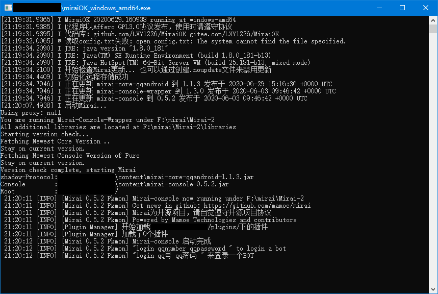
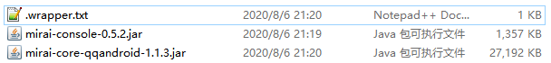
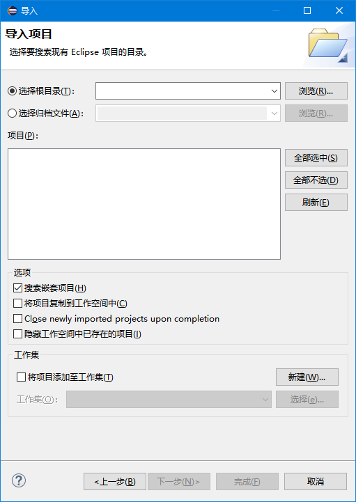
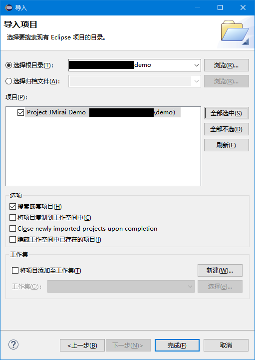
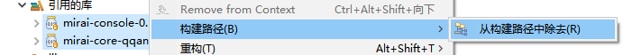
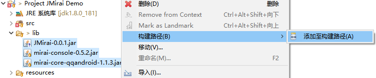
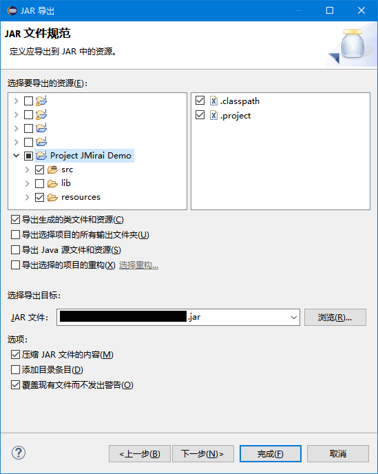

## JMirai Config Guide
本文将引导您(Java开发者)配置JMirai的开发环境。 
本文使用Eclipse IDE 2018.12版进行讲解,如使用Intellij IDEA等其它IDE的开发者可以参考本文的思路配置JMirai的开发环境。

### 1.配置mirai-console
请前往<a href="https://github.com/123-Open-Source-Organization/MiraiOK">MiraiOK项目</a>下载MiraiOK一键包。 
注意:请下载<b>Windows-amd64</b>版的MiraiOK。 

下载完成后请打开MiraiOK,出现类似下图界面则代表Mirai-Console加载完成。 
 
这时请关闭控制台窗口,在MiraiOK主程序同级目录下会出现如下的文件夹结构: 
 
请记住content文件夹的路径,会在稍后用到。 
mirai-console至此已配置完成。 

### 2.导入Mirai-Console库及JMirai库
打开第一步所提到的content文件夹,您会看到下列文件: 
 
除.wrapper.txt文件外均为Mirai-Console库,请记住这2个库文件的完整路径。 

请前往<a href="https://github.com/123-Open-Source-Organization/JMirai/releases">JMirai Release页</a>下载最新版的JMirai库文件(对应文件名格式应为JMirai-[版本号].jar)。 
下载完成后请记住JMirai库文件的完整路径。 

请前往<a href="https://github.com/123-Open-Source-Organization/JMirai/blob/master/demo">JMirai Demo</a>下载JMirai Demo插件项目文件夹(推荐直接clone整个JMirai项目后提取demo文件夹)。 

下载完成后请首先将Demo项目引用的库文件进行更新: 
1. 在Eclipse IDE主界面中，单击最上方菜单栏的"文件"-"导入",选择"常规"-"现有项目到工作空间中",出现如下界面: 
 

2. 单击"浏览",选择下载下来的Demo项目的根目录,单击"选择文件夹"。 

3. 此时Eclipse会显示Demo项目名(如下图),单击"全部全选"-"完成"导入Demo项目。 
 

4. 全选"引用的库"中的两个jar文件,右键-"构建路径"-"从构建路径中除去"。 
 

5. 此时Eclipse会报告无法解析类型net.mamoe.mirai.message....等错误,请忽略错误并将lib文件夹下的所有jar文件全部删除。 

6. 将前面所提到的Mirai-Console库的2个库文件和JMirai库文件复制进lib文件夹中，并右键这3个库文件-"构建路径"-"添加到构建路径"。 
 

此时您已经导入完毕所需库,下面进行插件信息配置

### 3.配置插件信息
使用记事本或Notepad++等文本编辑器打开项目根目录下的<a href="https://github.com/123-Open-Source-Organization/mirai-console/blob/master/demo/resources/plugin.yml">resources/plugin.yml</a>文件。 
该文件编写格式请参考<a href="https://github.com/123-Open-Source-Organization/mirai-console/blob/master/PluginDocs/PluginStructure.MD">这里(PluginStructure)</a>。 

编写完成保存后请打开<a href="https://github.com/123-Open-Source-Organization/mirai-console/blob/master/demo/src/com/example/Demo.java">src/com/example/Demo.java</a>文件,开始你的插件编写之旅吧!(此时可参考JMirai的Javadoc) 

### 4.生成插件jar文件
若编写完毕需要生成插件jar文件以便Mirai-Console加载,请右键整个Demo项目-"导出"。 

如下图,选择项目文件夹下的src文件夹和resources文件夹(不要选lib文件夹),指定导出到的路径(建议直接导出到MiraiOK所在目录/plugins下),然后单击"完成"即可生成jar文件。 
 
将jar文件移动至MiraiOK所在目录/plugins下，重新启动MiraiOK即可加载插件。

------
本文最后编辑日期: Aug 6,2020